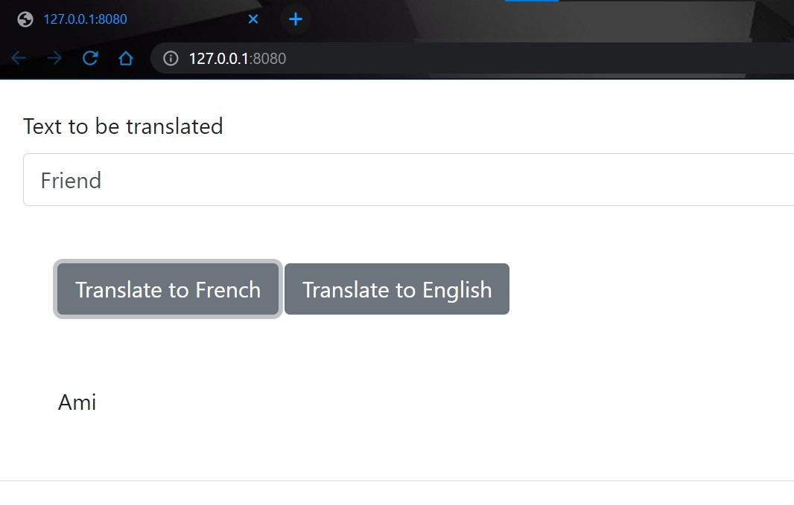
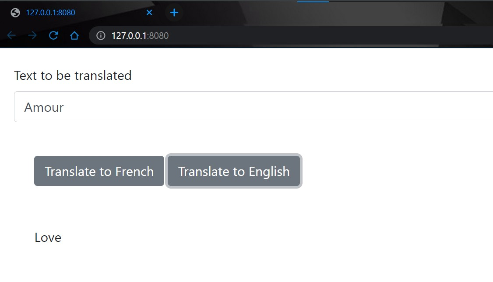

# Python Project for AI & Application Development
## Index
1) IBM Skills Network - Intro to the project
   1) Important Notes
2) Instructions
   1) How to install
   2) Version Updates
3) Screenshots of working solution
4) Author and Licence


## IBM Skills Network - Intro to the project
The starting point of this project can be found here [IBM Project](https://github.com/ibm-developer-skills-network/xzceb-flask_eng_fr). This is a fork.  
I implemented the necessary code to make this project work (initial structure given, please check the repository).  
I included:
+ machinetranslation and all folders below it.
+ updated ```requirements.txt```. Flask is now latest version to prevent issues latest Jinja2 version.
+ updated variables and methods to recommended snake_case [NOT in server.py]
+ updated ```server.py``` to handle the web interaction.
+ created the docker image.

### Important Notes
You need an IBM Cloud account to be able to use IBM Watson™ Language Translator.  
All Docker interaction done using Skills Network Labs by IBM.

## Instructions
### How to install:  
- Fork the project.
- Configure GitBash:
  - `git config --global user.email "myemail@something.com"`
  - `git config --global user.name "MyUser"`
- Local clone `git clone <URL_PROJECT>` of the project in your local machine.
- Open your favourite IDE (I use [PyCharm](https://www.jetbrains.com/pycharm/)).
- Create a virtual environment (I am using Python 3.11).
- Install required packages using `py -m pip install -U -r requirements.txt`
- Remember to Commit and Push changes to your GitHub!

_.env file_
1) Create ```.env``` file under folder ```machinetranslation```.
2) Fill it with:
```
apikey={your_key}
url={your_url_from_IBM}
```
3) Check that the file is ignored when loading into GitHub.

### Version Updates:  
+ v0 -- 2023/03 - Deployed solution.

## Screenshots of working solution
_Checks done in local server; later deployed with Docker_  
All images are stored in readme_images folder. Delete at your own risk.  

Translation English -> French:    


Translation French -> English:  


## Author and Licence
This is a forked repository from IBM in March 2023:  
**[IBM Project](https://github.com/ibm-developer-skills-network/xzceb-flask_eng_fr)**  
2023 Copyright © - Licence [Apache](https://github.com/ibm-developer-skills-network/xzceb-flask_eng_fr/blob/master/LICENSE)  

Enhancements and other modifications by:  
**[Juan Carcedo](https://github.com/JuanCarcedo)**  